> **Chapter 3: Storage & Retrieval**

<u>Part 1. Data Structures That Power Your Database</u>

Fundamental db functions

-   Store data

-   Retrieve stored data later

2 families of storage engines

-   Log-structured

-   Page-oriented

-   Log file - bash scripting a kv store

    -   Db\_get – poor performance since scans entire file, cost O(n)

    -   Db\_set – good performance since appends

\#!/bin/bash

db\_set () {

echo "$1,$2" &gt;&gt; database

}

db\_get () {

grep "^$1," database | sed -e "s/^$1,//" | tail -n 1

}

**Hash indexes**

-   Use a hash map (dict) to store the offset of the key (index of key
    in the file)

    -   “Whenever you append a new key-value pair to the file, you also
        update the hash map to reflect the offset of the data you just
        wrote (this works both for inserting new keys and for updating
        existing keys). When you want to look up a value, use the hash
        map to find the offset in the data file, seek to that location,
        and read the value.”

    -   Key-value index == primary key index in relational dbs

Since file is append only, how to avoid running out of space:

-   Segmentation

    -   “Break the log into segments of a certain size by closing a
        segment file when it reaches a certain size, and making
        subsequent writes to a new segment file”

-   Compaction

    -   “Compaction means throwing away duplicate keys in the log, and
        keeping only the most recent update for each key.”

-   Merging

    -   “we can also merge several segments together at the same time as
        performing the compaction, as shown in Figure 3-3. Segments are
        never modified after they have been written, so the merged
        segment is written to a new file. The merging and compaction of
        frozen segments can be done in a background thread, and while it
        is going on, we can still continue to serve read and write
        requests as normal, using the old segment files. After the
        merging process is complete, we switch read requests to using
        the new merged segment instead of the old segments—and then the
        old segment files can simply be deleted.”

“Lots of detail goes into making this simple idea work in practice.
Briefly, some of the issues that are important in a real implementation
are:

-   **File format:** CSV is not the best format for a log. It’s faster
    and simpler to use a binary format that first encodes the length of
    a string in bytes, followed by the raw string (without need for
    escaping).

-   **Deleting records**: If you want to delete a key and its associated
    value, you have to append a special deletion record to the data file
    (sometimes called a tombstone). When log segments are merged, the
    tombstone tells the merging process to discard any previous values
    for the deleted key.

-   **Crash recovery**: If the database is restarted, the in-memory hash
    maps are lost. In principle, you can restore each segment’s hash map
    by reading the entire segment file from beginning to end and noting
    the offset of the most recent value for every key as you go along.
    However, that might take a long time if the segment files are large,
    which would make server restarts painful. Bitcask speeds up recovery
    by storing a snapshot of each segment’s hash map on disk, which can
    be loaded into memory more quickly.

-   **Partially written records:** The database may crash at any time,
    including halfway through appending a record to the log. Bitcask
    files include checksums, allowing such corrupted parts of the log to
    be detected and ignored.

-   **Concurrency control** :As writes are appended to the log in a
    strictly sequential order, a common implementation choice is to have
    only one writer thread. Data file segments are append-only and
    otherwise immutable, so they can be read concurrently by multiple
    threads.”

Hash index pros

-   Appends and segment merges are sequential writes (vs random)

-   Concurrency and crash recovery are simpler

-   “Merging old segments avoids the problem of data files getting
    fragmented over time.”

Hash index cons

-   Hash map must fit in memory, so large hash tables make this solution
    ineffective

-   Hash tables can be stored on disk but the disk I/O degrades
    performance

-   Range queries aren’t efficient (e.g. kitty000 – kitty999. Keys must
    be looked up individually

**SSTables and LSM-Trees**

Stands for sorted string tables

Requires that keys are sorted

Requires that each key only appears once in each merged segment file
(which the compaction process handles already)

Now possible to use a sparse in memory index, since finding keys around
an indexed key is easy since they will be nearby

**Constructing & maintaining SSTables**

“We can now make our storage engine work as follows:

-   When a write comes in, add it to an in-memory balanced tree data
    structure (for example, a red-black tree). This in-memory tree is
    sometimes called a memtable.

-   When the memtable gets bigger than some threshold—typically a few
    megabytes —write it out to disk as an SSTable file. This can be done
    efficiently because the tree already maintains the key-value pairs
    sorted by key. The new SSTable file becomes the most recent segment
    of the database. While the SSTable is being written out to disk,
    writes can continue to a new memtable instance.

-   In order to serve a read request, first try to find the key in the
    memtable, then in the most recent on-disk segment, then in the
    next-older segment, etc.

-   From time to time, run a merging and compaction process in the
    background to combine segment files and to discard overwritten or
    deleted values”

**Problem**: if db creshes, keys in the memtable that haven’t yet been
written to disk are lost

**Solution**: have an append-only log file for all keys written to the
memtable. If db crashes, keys can be restored. Discard the log each time
a memtable is written out to an SSTable

“**Making an LSM-tree out of SSTables**

The algorithm described here is essentially what is used in LevelDB
\[6\] and RocksDB \[7\], key-value storage engine libraries that are
designed to be embedded into other applications. Among other things,
LevelDB can be used in Riak as an alternative to Bitcask. Similar
storage engines are used in Cassandra and HBase \[8\], both of which
were inspired by Google’s Bigtable paper \[9\] (which introduced the
terms SSTable and memtable). Originally this indexing structure was
described by Patrick O’Neil et al. under the name Log-Structured
Merge-Tree (or LSM-Tree) \[10\], building on earlier work on
log-structured filesystems \[11\]. Storage engines that are based on
this principle of merging and compacting sorted files are often called
LSM storage engines”

**B Trees**

“Like SSTables, B-trees keep key-value pairs sorted by key”

However, instead of variable size segments and write segments
sequentially, B-trees use fixed-size blocks or pages, and read or write
one page at a time

**Index pages** contain keys are references to child pages

**Leaf pages** store individual keys and often their associated values

The number of references to child pages in one page of the B-tree is
called the *branching factor*.

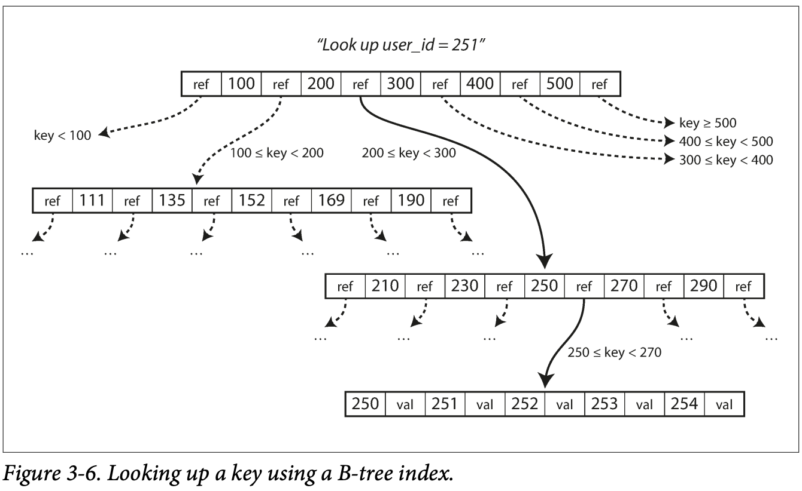

**Problem**: Since B-trees modify pages in place, there is a danger that
if the db crashes, the page could end up orphaned (no parent node)

**Solution**: write ahead logs are written (append-only) before each
database operation actually takes place, so the B-tree can be restored
in the event of a crash

**Other Indexing Structures**

Secondary indexes

-   Non-unique values

-   B-trees and log-structured indexes can be used

-   Indexes can store values along with the key (*clustered* index) or
    references to keys locations or primary keys themselves
    (*non-clustered* index, where values are stored in a *heap* file)

-   **Clustered index**: indexed row is stored directly within the index

-   **Non-clustered index**: references to keys are stored in the index,
    actual values are stored in a *heap file*

-   **Covering index** (*index with included columns*): some of the
    columns are stored within the index

-   **Multi-column index:** most often implemented as a concatenated
    index, where multiple fields are combined into a single key

-   **Full-text search and fuzzy indexes**: used for searching within
    text-based data

-   **In-memory databases:** Databases that are stored in memory
    (enabled by distributed systems and various other methods)
    (Memcached, VoltDB, MemSQL)

<u>Part 2. Transaction Processing or Analytics?</u>

OLTP vs OLAP

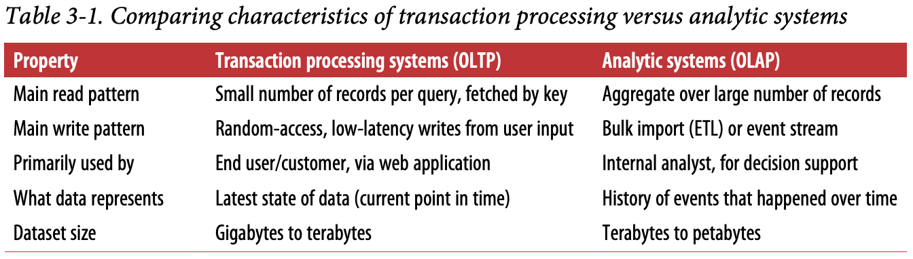

Data warehousing

-   Star & Snowflake schemas

-   Dimensional modeling, facts & dims

**Column oriented storage**

-   Instead of storing all vals from a row together, all values from a
    column are stored together

-   Only columns required by the query are loaded from disk

-   **Important thing** is that rows across column storage must be in
    the same order. That way we can know that the kth value in column
    file 1 belongs to the same record as that of column 2

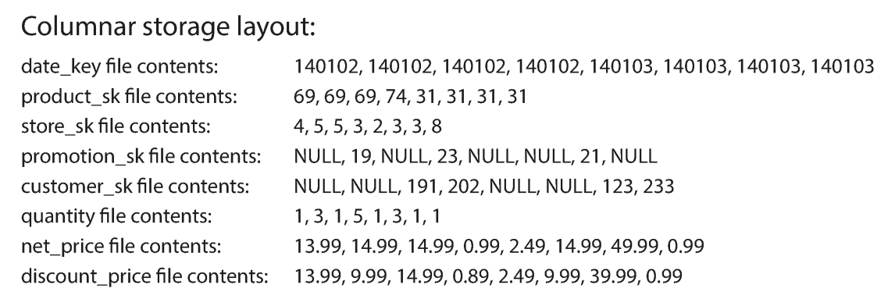

**Column compression**

Number of distinct values in a column is often lower than number of rows

-   **Bitmaps and run-length encoding**: “We can now take a column with
    n distinct values and turn it into n separate bitmaps: one bitmap
    for each distinct value, with one bit for each row. The bit is 1 if
    the row has that value, and 0 if not.”

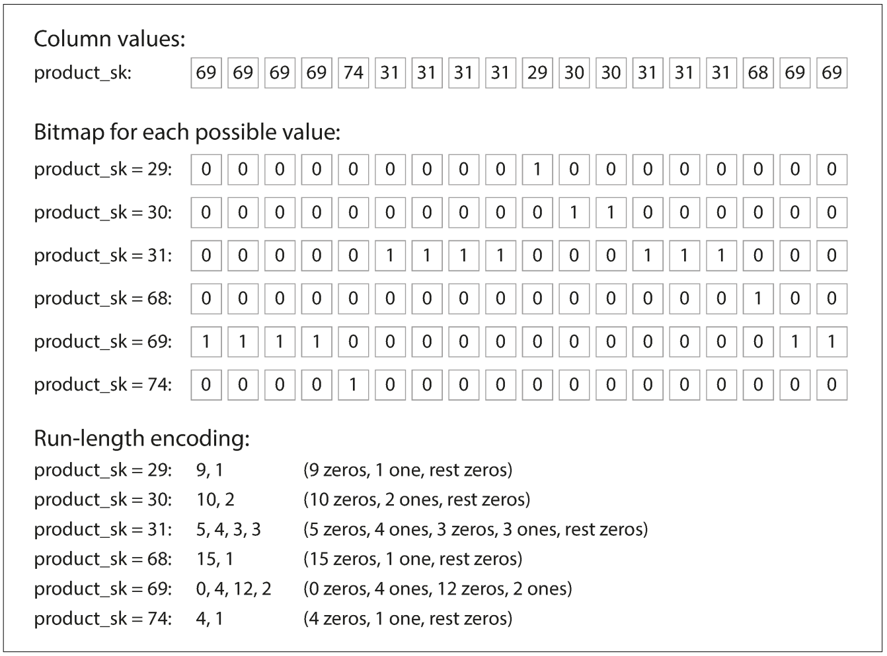

**Vectorized processing:** Bitwise operators (e.g AND, OR) can be used
on compressed columnar data to improve performance

**Sort order in column storage**

-   Data can be sorted by columns (e.g. date, product), making common
    query patterns faster to execute (e.g. engine only needs to scan
    rows from last month rather than entire table)

-   This also can improve compression since there will be long sequences
    of the same value. Run-length encoding can the compress these values
    very effectively

-   “That compression effect is strongest on the first sort key. The
    second and third sort keys will be more jumbled up, and thus not
    have such long runs of repeated values. Columns further down the
    sorting priority appear in essentially random order, so they
    probably won’t compress as well. But having the first few columns
    sorted is still a win overall.”

**Several different sort orders**

A clever extension of this idea was introduced in C-Store and adopted in
the com‐ mercial data warehouse Vertica \[61, 62\]. Different queries
benefit from different sort orders, so why not store the same data
sorted in several different ways? Data needs to be replicated to
multiple machines anyway, so that you don’t lose data if one machine
fails. You might as well store that redundant data sorted in different
ways so that when you’re processing a query, you can use the version
that best fits the query pattern. Having multiple sort orders in a
column-oriented store is a bit similar to having mul‐ tiple secondary
indexes in a row-oriented store. But the big difference is that the
roworiented store keeps every row in one place (in the heap file or a
clustered index), and secondary indexes just contain pointers to the
matching rows. In a column store, there normally aren’t any pointers to
data elsewhere, only columns containing values.

**Writing to Column-Oriented Storage**

Column-oriented storage, compression, and sorting make reads faster but
writes slower

“An update-in-place approach, like B-trees use, is not possible with
compressed col‐ umns. If you wanted to insert a row in the middle of a
sorted table, you would most likely have to rewrite all the column
files. As rows are identified by their position within a column, the
insertion has to update all columns consistently. Fortunately, we have
already seen a good solution earlier in this chapter: LSM-trees. All
writes first go to an in-memory store, where they are added to a sorted
structure and prepared for writing to disk. It doesn’t matter whether
the in-memory store is row-oriented or column-oriented. When enough
writes have accumulated, they are merged with the column files on disk
and written to new files in bulk. This is essen‐ tially what Vertica
does \[62\]. Queries need to examine both the column data on disk and
the recent writes in mem‐ ory, and combine the two. However, the query
optimizer hides this distinction from the user. From an analyst’s point
of view, data that has been modified with inserts, updates, or deletes
is immediately reflected in subsequent queries.”

**Materialized views**

“a materialized view is an actual copy of the query results, written to
disk”

**Data cubes**

Pre-aggregated tables

e.g. date on one axis and product on the other

Can have higher dimensions (e.g. sales by
date-product-store-promotion-customer combination)

**Summary**

“In this chapter we tried to get to the bottom of how databases handle
storage and retrieval. What happens when you store data in a database,
and what does the data‐ base do when you query for the data again
later?”

**High level storage engine distinctions**: OLTP vs OLAP

**OLTP high-level storage engine types:**

-   “The log-structured school, which only permits appending to files
    and deleting obsolete files, but never updates a file that has been
    written. Bitcask, SSTables, LSM-trees, LevelDB, Cassandra, HBase,
    Lucene, and others belong to this group

-   The update-in-place school, which treats the disk as a set of
    fixed-size pages that can be overwritten. B-trees are the biggest
    example of this philosophy, being used in all major relational
    databases and also many nonrelational ones.”

> **Chapter 4: Encoding and Evolution**

**Shema on read**: “schema-on-read (“schemaless”) databases don’t
enforce a schema, so the database can contain a mixture of older and
newer data formats written at different times”

When an application changes, the database often changes (e.g a new
record-type or field is added and needs to be handled)

-   **Backward compatibility**: Newer code can read data that was
    written by older code

    -   Easy to achieve by simply keeping the old code

-   **Forward compatibility**: Older code can read data that was written
    by newer code

    -   Harder to achieve with older code needing to ignore the
        additions made by newer code

**Chapter overview**

“In this chapter we will look at several formats for encoding data,
including JSON, XML, Protocol Buffers, Thrift, and Avro. In particular,
we will look at how they handle schema changes and how they support
systems where old and new data and code need to coexist. We will then
discuss how those formats are used for data storage and for
communication: in web services, Representational State Transfer (REST),
and remote procedure calls (RPC), as well as message-passing systems
such as actors and message queues.”

**Formats for encoding data**

In memory data is stored as objects, structs, lists, hashmaps, etc

Data stored on disk or transfered over the network is encoded as a
self-contained sequence of bytes

“The translation from the in-memory representation to a byte sequence is
called encoding (also known as serialization or marshalling), and the
reverse is called decoding (parsing, deserialization, unmarshalling).”

**Language specific formats**

“Many programming languages come with built-in support for encoding
in-memory objects into byte sequences. For example, Java has
java.io.Serializable \[1\], Ruby has Marshal \[2\], Python has pickle
\[3\], and so on.”

**JSON, XML, and Binary Variants**

JSON, XML, and CSV are common text-based encoding types

Some issues:

-   Encoding of numbers (distinguishing between ints, strings, floats)

-   Handling large numbers (some applications are unable to handle
    numbers larger than 2\*\*53, and that is not accounted for in the
    encoding schemes

-   Binary strings without a character encoding aren’t supported. Base64
    encoding often used as a workaround, but application schema must
    indicate the value is b64 encoded. Also increases data size by 33%

-   CSVs don’t have any schema

**Binary encoding**

There are lots of binary encodings for json (MessagePack, BSON, BJSON,
UBJSON, BISON) and xml (WBXML and Fast Infoset)

Example of binary encoding of json using MessagePack

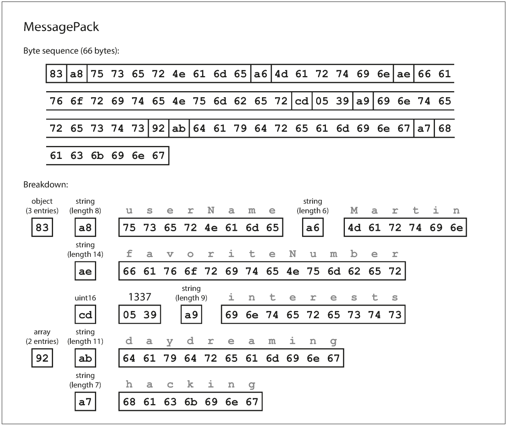

**Thrift and Protocol Buffers**

“Apache Thrift \[15\] and Protocol Buffers (protobuf) \[16\] are binary
encoding libraries that are based on the same principle. Protocol
Buffers was originally developed at Google, Thrift was originally
developed at Facebook, and both were made open source in 2007–08
\[17\].”

Thrift interface definition language (IDL) example:

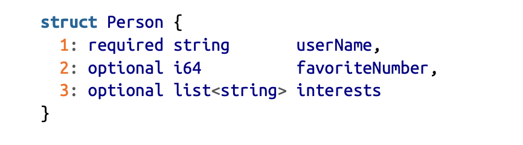

“Thrift and Protocol Buffers each come with a code generation tool that
takes a schema definition like the ones shown here, and produces classes
that implement the schema in various programming languages \[18\]. Your
application code can call this generated code to encode or decode
records of the schema.”

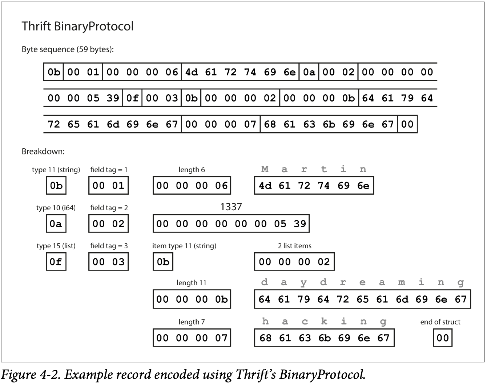

**Thrift BinaryProtocol** encoding scheme contains a binary
representation of a type annotation, and instead of field names it
contains the field tag (the number defined in the schema definition)

**Thrift CompactProtocol** adds additional compression by using variable
length integers and packing field tag and type into a single byte

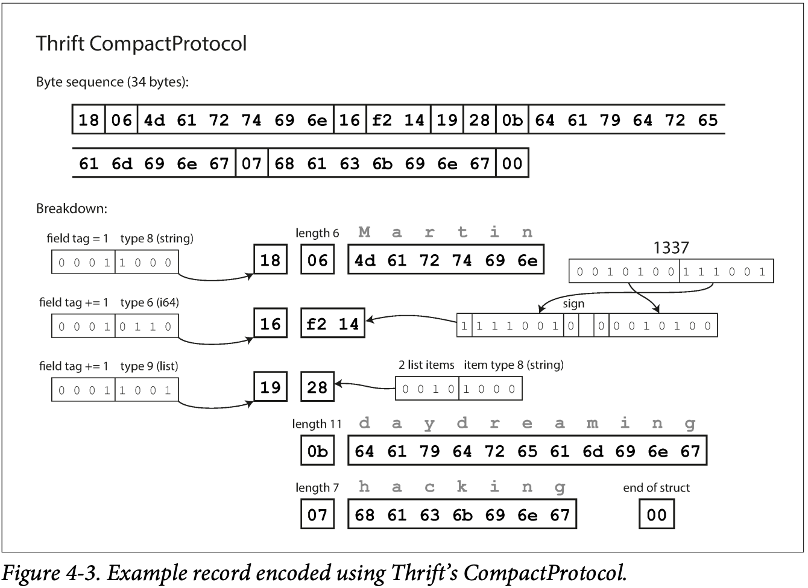

**Protocol Buffers** is very similar to Thrift CompactProtocol

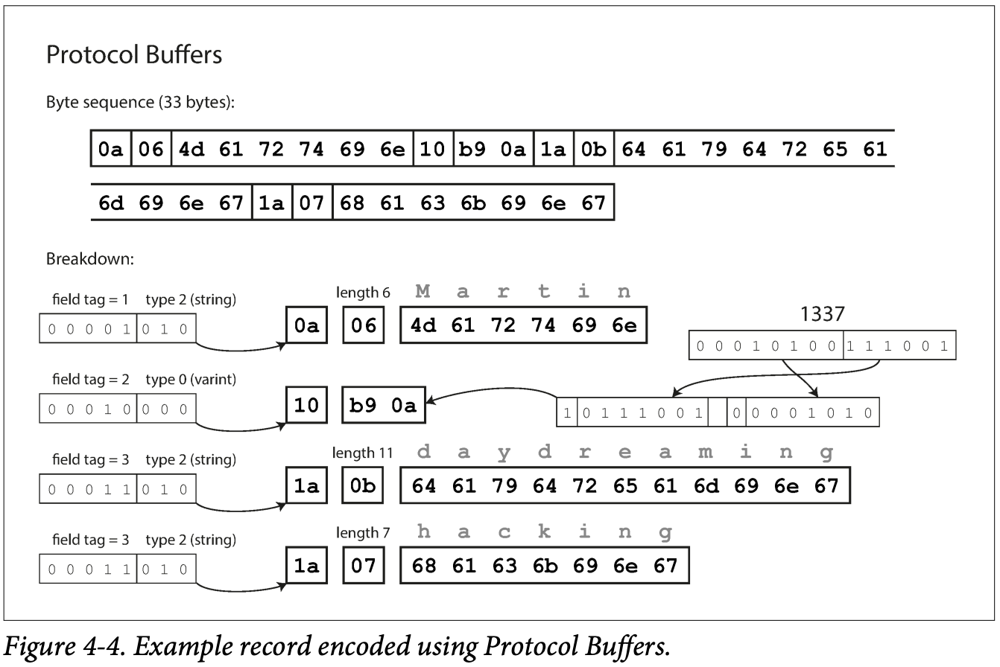

**Note**: Making a field required is not encoded into the binary
encoding, but enables a runtime check that fails if the field is missing

**Avro**

“Apache Avro \[20\] is another binary encoding format that is
interestingly different from Protocol Buffers and Thrift. It was started
in 2009 as a subproject of Hadoop, as a result of Thrift not being a
good fit for Hadoop’s use cases \[21\].”

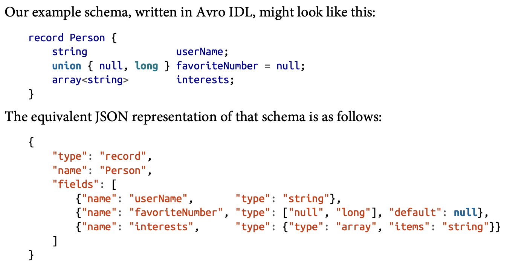

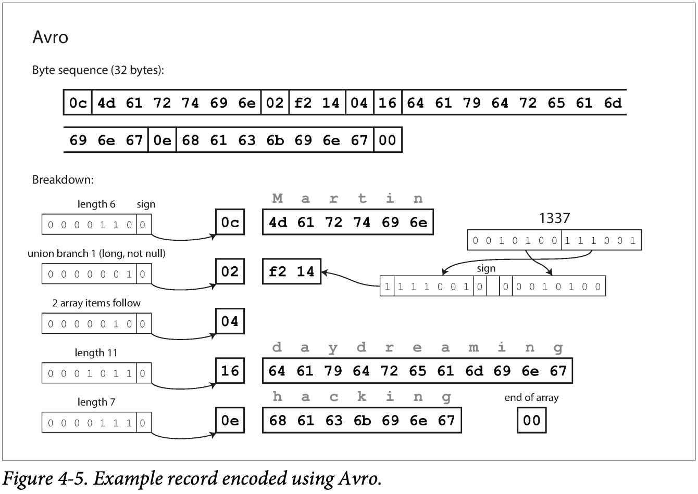

**Writer’s schema and reader’s schema**

**Writer’s schema**: “when an application wants to encode some data (to
write it to a file or database, to send it over the network, etc.), it
encodes the data using whatever version of the schema it knows about”

**Reader’s schema**: “When an application wants to decode some data
(read it from a file or database, receive it from the network, etc.), it
is expecting the data to be in some schema… That is the schema the
application code is relying on —code may have been generated from that
schema during the application’s build process”

These do not have to match exactly, but must be compatible

-   Order of fields doesn’t have to be same

-   If the application reading the data doesn’t recognize a field in the
    writer’s schema, it is ignored

-   If the reader expects a field not in the writer’s schema, it is
    filled with a default

**Schema evolution with Avro**

“With Avro, forward compatibility means that you can have a new version
of the schema as writer and an old version of the schema as reader.
Conversely, backward compatibility means that you can have a new version
of the schema as reader and an old version as writer.”

Default values are important to not break forward and backward
compatibility (by adding or removing a field with no default value)

Avro uses the *union* type to allow nulls, and uses union types and
default values instead of *required* and *optional* field types

union { null, long, string } field;

**Schema versioning**

A record is kept of each schema version when schema changes take place,
and the schema version can be kept as an attribute of each record. When
transferring data over a bi-directional network connection, the sender
and receiver negotiate a schema version to use for the session.

“A database of schema versions is a useful thing to have in any case,
since it acts as documentation and gives you a chance to check schema
compatibility”

**Dynamically generated schemas**

A big advantage of Avro over Thrift and Protobuf is that it can generate
schemas dynamically, since it doesn’t use field tags (so field names are
simply mapped to column names when exporting data from a db). If field
tags were used, there would need to be metadata tables involved and
potentially manually managed.

**Modes of Dataflow**

We’ve discussed that when you want to send data to a process with which
you don’t share memory, you need to encode the data in some way (JSON,
XML, Protobuf, Thrift, Avro, etc)

We talked about schema evolution and forward and backward compatibility

Now we’ll discuss some common forms of data exchange between processes:

-   Databases

-   Service calls (REST and RPC)

-   Asynchronous message passing

**Dataflow through databases**

“In a database, the process that writes to the database encodes the
data, and the process that reads from the database decodes it. There may
just be a single process accessing the database, in which case the
reader is simply a later version of the same process—in that case you
can think of storing something in the database as sending a message to
your future self. Backward compatibility is clearly necessary here;
otherwise your future self won’t be able to decode what you previously
wrote.”

**Different values written at different times**

*Data outlives code:* Updating the code in an application is often done
in a matter of minutes, however the data written by that application in
the past is not usually updated along with the code

*Migrations* to a new schema can be done but are costly, and most
relational databases allow schema changes such as adding new columns
with a null value as the default.

**Dataflow Through Services: REST and RPC**

*Clients and servers*: “The servers expose an API over the network, and
the clients can connect to the servers to make requests to that API. The
API exposed by the server is known as a service.”

A server can also be a client to another service (like a database)

*service-oriented architecture* (SOA) or *microservices* *architecture*:
larger applications are composed of smaller services with narrow areas
of functionality

as opposed to a database, which allows for arbitrary queries, “services
expose an application-specific API that only allows inputs and outputs
that are predetermined by the business logic (application code) of the
service”

A key design goal of a service-oriented/microservices architecture is to
make the application easier to change and maintain by making services
independently deployable and evolvable. For example, each service should
be owned by one team, and that team should be able to release new
versions of the service frequently, without having to coordinate with
other teams. In other words, we should expect old and new versions of
servers and clients to be running at the same time, and so the data
encoding used by servers and clients must be compatible across versions
of the service API— precisely what we’ve been talking about in this
chapter.”

**Web services**

“When HTTP is used as the underlying protocol for talking to the
service, it is called a web service”

Some examples

1.  A client application running on a user’s device (e.g., a native app
    on a mobile device, or JavaScript web app using Ajax) making
    requests to a service over HTTP. These requests typically go over
    the public internet.

2.  One service making requests to another service owned by the same
    organization, often located within the same datacenter, as part of a
    service-oriented/microser‐ vices architecture. (Software that
    supports this kind of use case is sometimes called middleware.)

3.  One service making requests to a service owned by a different
    organization, usu‐ ally via the internet. This is used for data
    exchange between different organiza‐ tions’ backend systems. This
    category includes public APIs provided by online services, such as
    credit card processing systems, or OAuth for shared access to user
    data.

Two main approaches to web services: *REST* and *SOAP*

“REST is not a protocol, but rather a design philosophy that builds upon
the principles of HTTP \[34, 35\]. It emphasizes simple data formats,
using URLs for identifying resources and using HTTP features for cache
control, authentication, and content type negotiation. REST has been
gaining popularity compared to SOAP, at least in the context of
cross-organizational service integration \[36\], and is often associated
with microservices \[31\].

By contrast, SOAP is an XML-based protocol for making network API
requests. Although it is most commonly used over HTTP, it aims to be
independent from HTTP and avoids using most HTTP features. Instead, it
comes with a sprawling and complex multitude of related standards (the
web service framework, known as WS-\*) that add various features”

**The problems with remote procedure calls (RPCs)**

“The RPC model tries to make a request to a remote network service look
the same as calling a function or method in your programming language”

This seems convenient but has a lot of issues because of the major
differences between local function calls and network requests

RPC frameworks have been built on top of all the encodings mentioned in
this chapter (Avro, Thrift, Protobuf)

REST is the predominant style for public APIs

RPC frameworks are focused mainly on requests between services owned by
the same organization, typically within the same datacenter

**Schema evolution in services**: the rules for schema changes are set
by the encoding used by the service (e.g. JSON, XML, Avro, Protobuf,
Thrift rules described above for forward and backward compatibility)

API versioning can be specified by the client via a version number
specified in the url, an HTTP accept header, or an administrative
interface for APIs that use an API key for client identification

**Message-Passing Dataflow**

***Asyncronous message-passing* systems** “are somewhere between RPC and
databases. They are similar to RPC in that a client’s request (usually
called a *message*) is delivered to another process with low latency.
They are similar to databases in that the message is not sent via a
direct network connection, but goes via an intermediary called a
*message broker* (also called a *message queue* or *message-oriented
middleware*), which stores the message temporarily.

Using a message broker has several advantages compared to direct RPC:

-   It can act as a buffer if the recipient is unavailable or
    overloaded, and thus improve system reliability.

-   It can automatically redeliver messages to a process that has
    crashed, and thus prevent messages from being lost.

-   It avoids the sender needing to know the IP address and port number
    of the recipient (which is particularly useful in a cloud deployment
    where virtual machines often come and go).

-   It allows one message to be sent to several recipients.

-   It logically decouples the sender from the recipient (the sender
    just publishes messages and doesn’t care who consumes them).”

The communication pattern here is *asynchronous*, since it doesn’t wait
for a message to be delivered before sending more messages

Messages are sent to a named *queue* or *topic*, and the message broker
handles delivery of messages to *consumers* or *subscribers* of that
topic

A topic provides one-way data flow, but consumers can pass received
messages to another topic, so message queues can be chained together

Messages can use any encoding format, since they are treated as a
sequence of bytes, and message brokers don’t enforce a schema of any
kind

**Distributed actor frameworks**

“The *actor model* is a programming model for concurrency in a single
process.”

-   An actor represents one client, with logic encapsulated in the actor
    rather than dealing directly with threads

-   May have local state not shared with other actors

-   Communicates with other actors by sending or receiving asynchronous
    messages

-   Actors only process one message at a time, so no need for dealing
    with threads

In *distributed actor frameworks*, this programming model is scaled
across multiple nodes. If actors are on separate nodes, messages are
encoded into byte sequences and shared across the network

3 common distributed actor frameworks

Akka

Orleans

Erlang OTP

**Ch 4 summary**

“In this chapter we looked at several ways of turning data structures
into bytes on the network or bytes on disk. We saw how the details of
these encodings affect not only their efficiency, but more importantly
also the architecture of applications and your options for deploying
them.”

We covered rolling upgrades, where a new version of an application is
deployed gradually to several nodes at a time, rather than to all nodes
at once. This kind of deployment requires forward and backward
compatibility, as new code may be reading data written by old code and
vice-versa.

We discussed several common encoding formats:

-   Programming language specific (e.g. pickle)

-   Text based (e.g. JSON, XML)

-   Binary formats (e.g. Thrift, Avro, Protobuf)

We discussed several common modes of dataflow:

-   Databases

-   REST and RPC APIs

-   Async message passing
