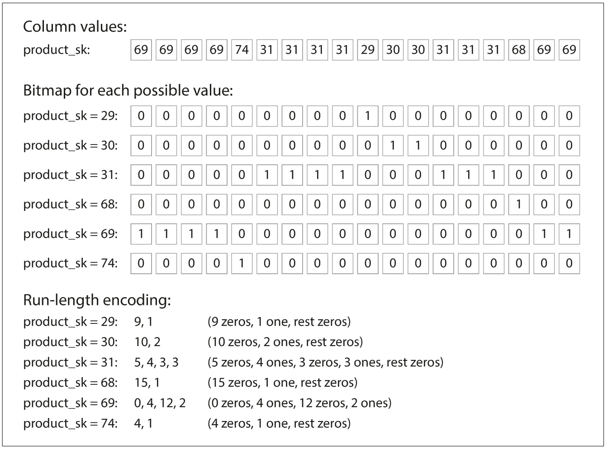

> **Chapter 3: Storage & Retrieval**

<u>Part 1. Data Structures That Power Your Database</u>

Fundamental db functions

-   Store data

-   Retrieve stored data later

2 families of storage engines

-   Log-structured

-   Page-oriented

-   Log file - bash scripting a kv store

    -   Db\_get – poor performance since scans entire file, cost O(n)

    -   Db\_set – good performance since appends

\#!/bin/bash

db\_set () {

echo "$1,$2" &gt;&gt; database

}

db\_get () {

grep "^$1," database | sed -e "s/^$1,//" | tail -n 1

}

**Hash indexes**

-   Use a hash map (dict) to store the offset of the key (index of key
    in the file)

    -   “Whenever you append a new key-value pair to the file, you also
        update the hash map to reflect the offset of the data you just
        wrote (this works both for inserting new keys and for updating
        existing keys). When you want to look up a value, use the hash
        map to find the offset in the data file, seek to that location,
        and read the value.”

    -   Key-value index == primary key index in relational dbs

Since file is append only, how to avoid running out of space:

-   Segmentation

    -   “Break the log into segments of a certain size by closing a
        segment file when it reaches a certain size, and making
        subsequent writes to a new segment file”

-   Compaction

    -   “Compaction means throwing away duplicate keys in the log, and
        keeping only the most recent update for each key.”

-   Merging

    -   “we can also merge several segments together at the same time as
        performing the compaction, as shown in Figure 3-3. Segments are
        never modified after they have been written, so the merged
        segment is written to a new file. The merging and compaction of
        frozen segments can be done in a background thread, and while it
        is going on, we can still continue to serve read and write
        requests as normal, using the old segment files. After the
        merging process is complete, we switch read requests to using
        the new merged segment instead of the old segments—and then the
        old segment files can simply be deleted.”

“Lots of detail goes into making this simple idea work in practice.
Briefly, some of the issues that are important in a real implementation
are:

-   **File format:** CSV is not the best format for a log. It’s faster
    and simpler to use a binary format that first encodes the length of
    a string in bytes, followed by the raw string (without need for
    escaping).

-   **Deleting records**: If you want to delete a key and its associated
    value, you have to append a special deletion record to the data file
    (sometimes called a tombstone). When log segments are merged, the
    tombstone tells the merging process to discard any previous values
    for the deleted key.

-   **Crash recovery**: If the database is restarted, the in-memory hash
    maps are lost. In principle, you can restore each segment’s hash map
    by reading the entire segment file from beginning to end and noting
    the offset of the most recent value for every key as you go along.
    However, that might take a long time if the segment files are large,
    which would make server restarts painful. Bitcask speeds up recovery
    by storing a snapshot of each segment’s hash map on disk, which can
    be loaded into memory more quickly.

-   **Partially written records:** The database may crash at any time,
    including halfway through appending a record to the log. Bitcask
    files include checksums, allowing such corrupted parts of the log to
    be detected and ignored.

-   **Concurrency control** :As writes are appended to the log in a
    strictly sequential order, a common implementation choice is to have
    only one writer thread. Data file segments are append-only and
    otherwise immutable, so they can be read concurrently by multiple
    threads.”

Hash index pros

-   Appends and segment merges are sequential writes (vs random)

-   Concurrency and crash recovery are simpler

-   “Merging old segments avoids the problem of data files getting
    fragmented over time.”

Hash index cons

-   Hash map must fit in memory, so large hash tables make this solution
    ineffective

-   Hash tables can be stored on disk but the disk I/O degrades
    performance

-   Range queries aren’t efficient (e.g. kitty000 – kitty999. Keys must
    be looked up individually

**SSTables and LSM-Trees**

Stands for sorted string tables

Requires that keys are sorted

Requires that each key only appears once in each merged segment file
(which the compaction process handles already)

Now possible to use a sparse in memory index, since finding keys around
an indexed key is easy since they will be nearby

**Constructing & maintaining SSTables**

“We can now make our storage engine work as follows:

-   When a write comes in, add it to an in-memory balanced tree data
    structure (for example, a red-black tree). This in-memory tree is
    sometimes called a memtable.

-   When the memtable gets bigger than some threshold—typically a few
    megabytes —write it out to disk as an SSTable file. This can be done
    efficiently because the tree already maintains the key-value pairs
    sorted by key. The new SSTable file becomes the most recent segment
    of the database. While the SSTable is being written out to disk,
    writes can continue to a new memtable instance.

-   In order to serve a read request, first try to find the key in the
    memtable, then in the most recent on-disk segment, then in the
    next-older segment, etc.

-   From time to time, run a merging and compaction process in the
    background to combine segment files and to discard overwritten or
    deleted values”

**Problem**: if db creshes, keys in the memtable that haven’t yet been
written to disk are lost

**Solution**: have an append-only log file for all keys written to the
memtable. If db crashes, keys can be restored. Discard the log each time
a memtable is written out to an SSTable

“**Making an LSM-tree out of SSTables**

The algorithm described here is essentially what is used in LevelDB
\[6\] and RocksDB \[7\], key-value storage engine libraries that are
designed to be embedded into other applications. Among other things,
LevelDB can be used in Riak as an alternative to Bitcask. Similar
storage engines are used in Cassandra and HBase \[8\], both of which
were inspired by Google’s Bigtable paper \[9\] (which introduced the
terms SSTable and memtable). Originally this indexing structure was
described by Patrick O’Neil et al. under the name Log-Structured
Merge-Tree (or LSM-Tree) \[10\], building on earlier work on
log-structured filesystems \[11\]. Storage engines that are based on
this principle of merging and compacting sorted files are often called
LSM storage engines”

**B Trees**

“Like SSTables, B-trees keep key-value pairs sorted by key”

However, instead of variable size segments and write segments
sequentially, B-trees use fixed-size blocks or pages, and read or write
one page at a time

**Index pages** contain keys are references to child pages

**Leaf pages** store individual keys and often their associated values

The number of references to child pages in one page of the B-tree is
called the *branching factor*.

**Problem**: Since B-trees modify pages in place, there is a danger that
if the db crashes, the page could end up orphaned (no parent node)

**Solution**: write ahead logs are written (append-only) before each
database operation actually takes place, so the B-tree can be restored
in the event of a crash

**Other Indexing Structures**

Secondary indexes

-   Non-unique values

-   B-trees and log-structured indexes can be used

-   Indexes can store values along with the key (*clustered* index) or
    references to keys locations or primary keys themselves
    (*non-clustered* index, where values are stored in a *heap* file)

-   **Clustered index**: indexed row is stored directly within the index

-   **Non-clustered index**: references to keys are stored in the index,
    actual values are stored in a *heap file*

-   **Covering index** (*index with included columns*): some of the
    columns are stored within the index

-   **Multi-column index:** most often implemented as a concatenated
    index, where multiple fields are combined into a single key

-   **Full-text search and fuzzy indexes**: used for searching within
    text-based data

-   **In-memory databases:** Databases that are stored in memory
    (enabled by distributed systems and various other methods)
    (Memcached, VoltDB, MemSQL)

<u>Part 2. Transaction Processing or Analytics?</u>

OLTP vs OLAP

Data warehousing

-   Star & Snowflake schemas

-   Dimensional modeling, facts & dims

**Column oriented storage**

-   Instead of storing all vals from a row together, all values from a
    column are stored together

-   Only columns required by the query are loaded from disk

-   **Important thing** is that rows across column storage must be in
    the same order. That way we can know that the kth value in column
    file 1 belongs to the same record as that of column 2

**Column compression**

Number of distinct values in a column is often lower than number of rows

-   **Bitmaps and run-length encoding**: “We can now take a column with
    n distinct values and turn it into n separate bitmaps: one bitmap
    for each distinct value, with one bit for each row. The bit is 1 if
    the row has that value, and 0 if not.”

**Vectorized processing:** Bitwise operators (e.g AND, OR) can be used
on compressed columnar data to improve performance

**Sort order in column storage**

-   Data can be sorted by columns (e.g. date, product), making common
    query patterns faster to execute (e.g. engine only needs to scan
    rows from last month rather than entire table)

-   This also can improve compression since there will be long sequences
    of the same value. Run-length encoding can the compress these values
    very effectively

-   “That compression effect is strongest on the first sort key. The
    second and third sort keys will be more jumbled up, and thus not
    have such long runs of repeated values. Columns further down the
    sorting priority appear in essentially random order, so they
    probably won’t compress as well. But having the first few columns
    sorted is still a win overall.”

**Several different sort orders**

A clever extension of this idea was introduced in C-Store and adopted in
the com‐ mercial data warehouse Vertica \[61, 62\]. Different queries
benefit from different sort orders, so why not store the same data
sorted in several different ways? Data needs to be replicated to
multiple machines anyway, so that you don’t lose data if one machine
fails. You might as well store that redundant data sorted in different
ways so that when you’re processing a query, you can use the version
that best fits the query pattern. Having multiple sort orders in a
column-oriented store is a bit similar to having mul‐ tiple secondary
indexes in a row-oriented store. But the big difference is that the
roworiented store keeps every row in one place (in the heap file or a
clustered index), and secondary indexes just contain pointers to the
matching rows. In a column store, there normally aren’t any pointers to
data elsewhere, only columns containing values.

**Writing to Column-Oriented Storage**

Column-oriented storage, compression, and sorting make reads faster but
writes slower

“An update-in-place approach, like B-trees use, is not possible with
compressed col‐ umns. If you wanted to insert a row in the middle of a
sorted table, you would most likely have to rewrite all the column
files. As rows are identified by their position within a column, the
insertion has to update all columns consistently. Fortunately, we have
already seen a good solution earlier in this chapter: LSM-trees. All
writes first go to an in-memory store, where they are added to a sorted
structure and prepared for writing to disk. It doesn’t matter whether
the in-memory store is row-oriented or column-oriented. When enough
writes have accumulated, they are merged with the column files on disk
and written to new files in bulk. This is essen‐ tially what Vertica
does \[62\]. Queries need to examine both the column data on disk and
the recent writes in mem‐ ory, and combine the two. However, the query
optimizer hides this distinction from the user. From an analyst’s point
of view, data that has been modified with inserts, updates, or deletes
is immediately reflected in subsequent queries.”

**Materialized views**

“a materialized view is an actual copy of the query results, written to
disk”

**Data cubes**

Pre-aggregated tables

e.g. date on one axis and product on the other

Can have higher dimensions (e.g. sales by
date-product-store-promotion-customer combination)

**Summary**

“In this chapter we tried to get to the bottom of how databases handle
storage and retrieval. What happens when you store data in a database,
and what does the data‐ base do when you query for the data again
later?”

**High level storage engine distinctions**: OLTP vs OLAP

**OLTP high-level storage engine types:**

-   “The log-structured school, which only permits appending to files
    and deleting obsolete files, but never updates a file that has been
    written. Bitcask, SSTables, LSM-trees, LevelDB, Cassandra, HBase,
    Lucene, and others belong to this group

-   The update-in-place school, which treats the disk as a set of
    fixed-size pages that can be overwritten. B-trees are the biggest
    example of this philosophy, being used in all major relational
    databases and also many nonrelational ones.”
