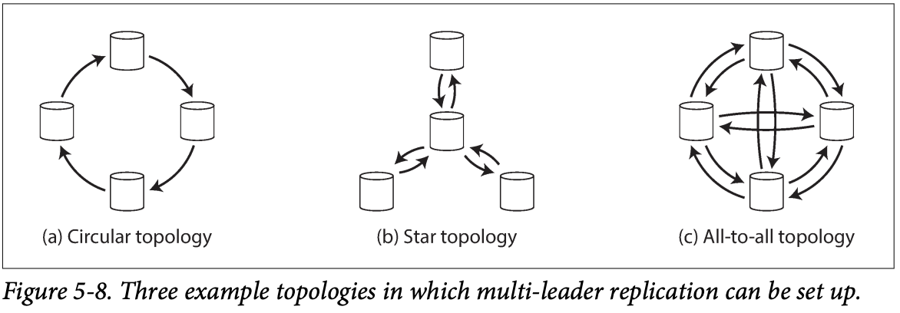
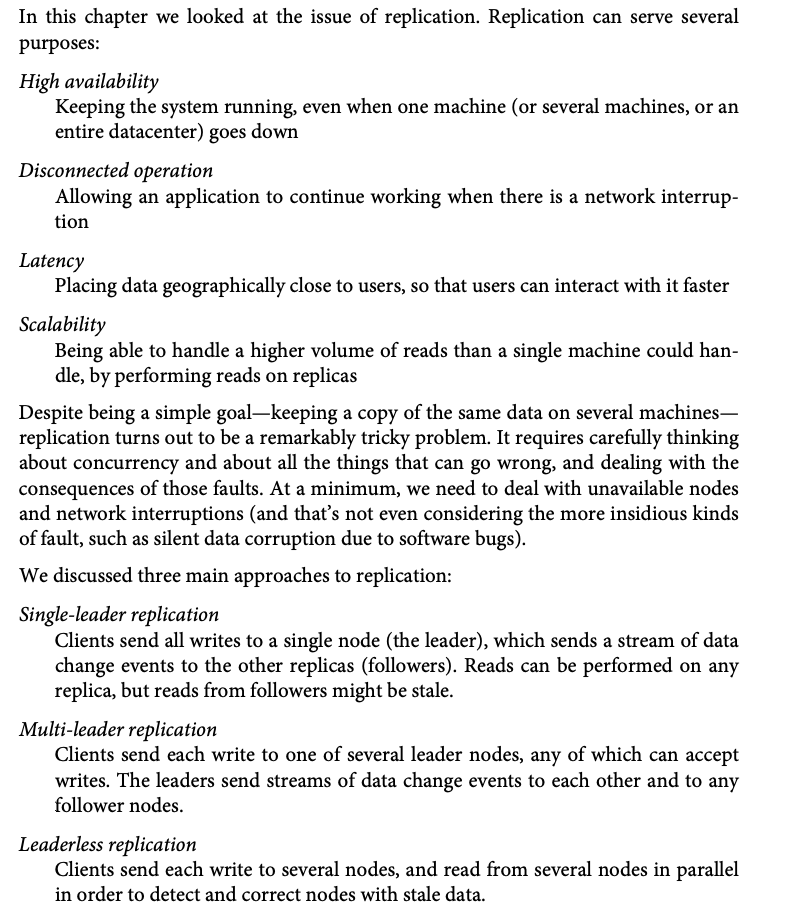
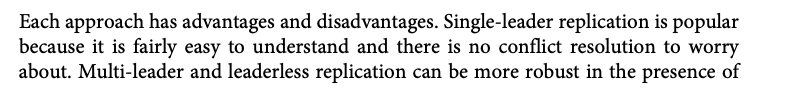
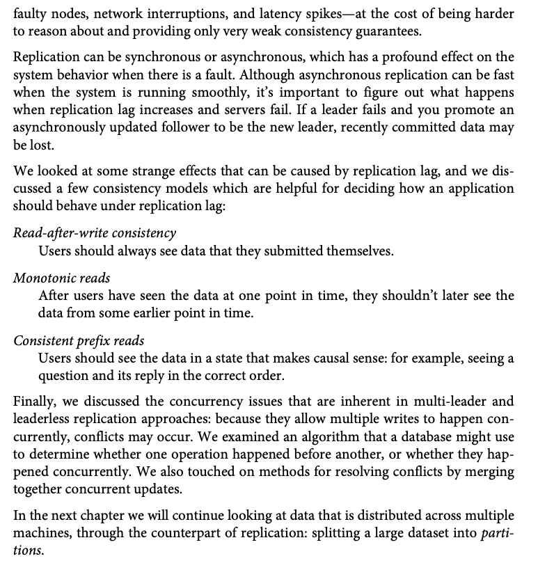

**PART II Distributed Data**

Part I covered systems that store data on a single machine. Part II
covers distributed systems.

Benefits of distributing databases across multiple machines:

-   Scalability

    -   If load grows beyond the capacity of a single machine

-   Fault tolerance/high availability

    -   If one machine fails, another can take over

-   Latency

    -   Leverage servers in various geographical location for closer
        proximity to users in various locations

**Shared-memory architecture (vertical scaling or scaling up)**

“Many CPUs, many RAM chips, and many disks can be joined together under
one operating system, and a fast interconnect allows any CPU to access
any part of the memory or disk. In this kind of ***shared-memory
architecture***, all the components can be treated as a single machine.”

With a shared-memory architecture, the cost of scaling “up” is not
linear. Doubling the computing power of a single machine more than
doubles it’s cost.

A shared-memory architecture can offer fault tolerance of individual
(hot-swappable) components, but it is bound to a single region.

A ***shared-disk architecture*** uses several machines that each have
their own CPU and RAM but share storage.

**Shared-nothing architecture (horizontal scaling or scaling out)**

Each virtual or physical machine running the database software is called
a *node*. Each node has its own independent CPU, memory, and disks.
**Coordination between nodes is done at the software level using a
conventional network**.

No special hardware is required for a distributed system.

“In this part of the book, we focus on shared-nothing architectures—not
because they are necessarily the best choice for every use case, but
rather because they require the most caution from you, the application
developer. If your data is distributed across multiple nodes, you need
to be aware of the constraints and trade-offs that occur in such a
distributed system—the database cannot magically hide these from you…
The next few chapters go into details on the issues that arise when data
is distributed.”

**Replication Versus Partitioning**

*Replication*

-   Keeps a copy of the same data on several different nodes

-   Provides redundancy

-   If one node is unavailable, the other(s) can still serve data

*Partitioning*

-   “Splitting a big database into smaller subsets called
    ***partitions*** so that different partitions can be assigned to
    different nodes (also known as ***sharding***).”

Chapter 5 will cover replication

Chapter 6 will cover partitioning

Chapter 7 will cover transactions

8 and 9 will cover fundamental limitations of distributed systems

**Replication**

“*Replication* means keeping a copy of the same data on multiple
machines connected via a network”

Reasons for replication:

-   To keep data geographically close to users

-   To protect data against failures on a single node (improving
    availability)

-   To scale out and serve read requests from multiple nodes

This chapter is about handling replication of data that changes, and in
particular will cover 3 algorithms for replicating changes between
nodes:

1.  Single leader replication

2.  Multi-leader replication

3.  Leaderless replication

**Leaders and Followers**

Each node that stores a copy of the database is called a *replica*

Every write needs to go to every replica in order for the replicas to
stay in sync

The commonest solution is *leader-based replication*

1.  One node is the *leader* – all write requests from clients go to the
    leader, and it writes the data to its local storage

2.  The leader then sends a the data change to all *follower* nodes in
    the form of a *replication log* or *change stream*. Each follower
    uses the log to apply the writes/updates to its copy of the data in
    the order they were received

3.  All writes go to the leader, but reads can be served by any of the
    nodes (followers are read only)

**Synchronous Versus Asynchronous Replication**

The leader can either wait for the follower to replicate the data change
(*synchronous*) or send the replication log message and not wait to
accept further write requests (*asynchronous*)

“The advantage of synchronous replication is that the follower is
guaranteed to have

an up-to-date copy of the data that is consistent with the leader. If
the leader suddenly fails, we can be sure that the data is still
available on the follower. The disadvantage is that if the synchronous
follower doesn’t respond (because it has crashed,

or there is a network fault, or for any other reason), the write cannot
be processed.

The leader must block all writes and wait until the synchronous replica
is available

again.”

*Semi-synchronous* systems typically have **one** synchronous follower
with all the rest being async. If the synchronous follower fails,
another is made synchronous. This way, there is always at least two
nodes with up-to-date data.

Leader-based replication is often completely asynchronous. The
disadvantage here is that if the leader node fails, the write will be
lost even if it was confirmed to the client. The advantage is that even
if all the follower nodes fall behind, the leader can continue
processing write requests.

**Setting Up New Followers**

Simply copying the data from the leader to a new follower will not work,
since there are writes happening all the time. Locking the database to
do the copy is obviously not an option as it violates the availability
requirement. So the way to do it is like this:

1.  Take a snapshot of the database

2.  Copy snapshot to follower

3.  Follower requests all data change logs since the time of the
    snapshot (requires that the snapshot be located at an exact position
    in the leader’s replication log. Postgres calls this the *log
    sequence number*, MySQL calls it the *binlog coordinates*)

4.  Once the follower has processed all these changes, it is *caught up*
    and can continue to process further changes as they happen

**Handling Node Outages**

Node downtime, either due to failure or planned maintenance, is common,
and to support the availability requirement the system as a whole must
be able to continue serving when individual nodes go down.

**Follower failure: Catch-up recovery**

If a follower fails it can recover easily using the catch-up method
described above. If a follower crashes and is restarted, or the network
between the follower and the leader is interrupted, the follower knows
its location in the leader’s replication log before it went down, and
can use the catch-up method to request all changes since it went down to
recover.

**Leader failure: Failover**

Handling leader failure is a bigger challenge.

1.  There is no direct way to determine whether the leader has failed,
    so a “timeout” limit is often used (e.g. 30 seconds since the
    leader’s last response)

2.  A new leader must be chosen, either dynamically or predetermined. If
    dynamically, the best choice is usually the follower that is most
    caught-up with the leader, and getting all the nodes to agree on the
    new leader is a consensus problem

3.  Once the new leader is chosen, client write requests must be routed
    to the new leader (using request routing), and when the old leader
    comes back online it needs to be informed it is now a follower

Things that can go wrong:

1.  If replication is async, the writes to the leader may not be
    replicated on any follower nodes, violating durability requirements
    (see GitHub MySQL example)

2.  The old leader may still think it is the leader when it comes back
    up, and the system can suffer from “*split brain*”, where both
    leaders accept writes and conflicts arise. In such a case data is
    likely to be lost or corrupted

3.  If the failover process is initiated due to a false failure signal
    (i.e the timeout was due to something other than the leader node
    actually going down), the failover process will cause more harm than
    good, especially if there is already a high load or network
    problems, which probably caused the timeout threshold to be exceeded
    in the first place

**GitHub MySQL example:**

“Discarding writes is especially dangerous if other storage systems
outside of the database need to be coordinated with the database
contents. For example, in one incident at GitHub, an out-of-date MySQL
follower was promoted to leader. The database used an autoincrementing
counter to assign primary keys to new rows, but because the new leader’s
counter lagged behind the old leader’s, it reused some primary keys that
were previously assigned by the old leader. These primary keys were also
used in a Redis store, so the reuse of primary keys resulted in
inconsistency between MySQL and Redis, which caused some private data to
be disclosed to the wrong users.”

**Implementation of Replication Logs**

Several methods are used for leader-based replication

**Statement-based replication**

The leader logs every write statement (e.g INSERT, UPDATE, DELETE in
relational db) that it executes to the replication log that is sent to
its followers, and followers execute the statement

Problems with this:

-   Nondeterministic functions like now(), rand() will produce different
    values on each replica

-   Autoincrementing values or conditional statements like “delete
    where” must be executed in exactly the same order on all nodes

-   Statements with side effects (triggers, stored procs, UDFs) may
    result in different side effects occurring on each replica

**Write-ahead log (WAL) shipping**

With log-structured storage engines (SSTables and LSM-Trees), the
storage itself is also the log

With B-Trees, all write operations are first written to a write ahead
log (WAL), so if the db crashes the index can be restored

Either way, the log can be used to build a replica on another node

**Logical (row-based) log replication**

Row-based replication uses a different log format for replication and
the storage engine. This is called a *logical log*, as distinguished
from the storage engine’s (*physical*) data representation

A logical log is a sequence of records describing writes:

-   Insert logs contain the new values for all columns

-   Deletes contain enough to uniquely ID the deleted row (usually a pk)

-   Updates contain enough info to uniquely ID the record and the new
    values for all columns

This separation of log format and physical data format makes systems
backward compatible, allowing the leader and followers to run different
versions of the database engine, or even different engines

The logical log format also is easier for applications to parse, and
makes it easier to send to external systems like a data warehouse
(supporting *change data capture*, covered in chapter 11)

**Trigger-based replication**

The above replication methods are executed by the database without
involving any application code. In cases where you want to replicate
only a subset of the data, or replicate from one kind of db to another,
the replication process needs to be moved up to the application layer

“A trigger lets you register custom application code that is
automatically executed when a data change (write transaction) occurs in
a database system. The trigger has the opportunity to log this change
into a separate table, from which it can be read by an external process.
That external process can then apply any necessary application logic and
replicate the data change to another system. Databus for Oracle and
Bucardo for Postgres work like this, for example.

Trigger-based replication typically has greater overheads than other
replication methods, and is more prone to bugs and limitations than the
database’s built-in replication. However, it can nevertheless be useful
due to its flexibility.”

**Problems with Replication Lag**

***Reminder***

Reasons for replication:

1.  Tolerate node failures

2.  Scalability (process more requests than a single machine can handle)

3.  Latency (replicating geographically closer to users)

*Read-scaling* architecture for read-heavy workloads: distribute
requests across many followers, reducing the load on the leader (only
realistic with async replication)

***Eventual consistency***: using async replication, there is a lag
between writes to the leader and writes to the followers (called
*replication lag*), so reads from a follower that happen just after
writes to the leader may be out of date. However, the data will be
updated eventually (fractions of a second typically but potentially up
to minutes)

3 problems that arise out of eventual consistency will be covered next

**Reading Your Own Writes**

*Read-your-writes-consistency* (or *read-after-write* consistency) is
important in many applications: it allows users to see the write they’ve
made immediately (e.g. a comment on a thread). The issue arises here
with asynchronous replication, where the write goes to the leader and
the read is queried from a follower and isn’t written there yet. Bear in
mind read-after-write consistency makes no promise that other users will
see it immediately.

There are a few ways to ensure this in a leader-based replication
system:

-   When reading something that may have been modified, read it from the
    leader (e.g. any user profile info, since it is only writable by
    that user)

-   Use a timestamp of the last update, and read from the leader only
    until a minute after that timestamp

**Monotonic Reads**

The second anomaly is when a user reads data from one replica, sees a
value, and then reads from another (e.g. refreshes the page), and sees a
different value or no value (because the second replica is lagging
behind the first)

Monotonic reads guarantee this won’t happen. One way to make this
guarantee is by having the same user read always from the same replica

**Consistent Prefix Reads**

The final issue that can arise with asynchronous replication is users
seeing writes out of order (e.g. they see a reply before the initial
comment)

*Consistent prefix reads* ensure that users see writes in the sequence
they were written

**Solutions for Replication Lag**

Application code can mitigate replication lag to some degree (e.g. by
doing read-your-own-writes on the leader), but it overcomplicates the
application code and is easy to get wrong

*Transactions* are another good solution that will be discussed further
in chapters 7 and 9.

**Multi-Leader Replication**

Single leader-based replication has one major downside: there is only
one leader and all writes must go through it

In *multi-leader* replication, each node that processes a write must
forward it to all other nodes, and leaders must simultaneously act as
followers

**Use Cases for Multi-Leader Replication**

**Multi-datacenter operation**

-   Leader in each datacenter instead of one leader in one datacenter
    and followers in other data centers

-   Replication to followers happens as usual within datacenters, and
    cross-datacenter replication happens from leader to leader

The biggest issue with multi-leader replication is that the same data
may be concurrently modified in two different data centers, and those
conflicts have to be resolved

“…autoincrementing keys, triggers, and integrity constraints can be
problematic. For this reason, multi-leader replication is often
considered dangerous territory that should be avoided if possible”

**Clients with offline operation**

Applications that need to continue to work when disconnected from the
internet (e.g. calendar app)

In this case, every device has a local database that acts as a leader,
and there is an async multi-leader replication process between the
device on which the modification has taken place and your other devices

“From an architectural point of view, this setup is essentially the same
as multi-leader replication between datacenters, taken to the extreme:
each device is a “datacenter,” and the network connection between them
is extremely unreliable. As the rich history of broken calendar sync
implementations demonstrates, multi-leader replication is a tricky thing
to get right.”

**Collaborative editing**

“Real-time collaborative editing applications allow several people to
edit a document simultaneously” e.g. google docs

This isn’t exactly database replication, but has similar challenges

Instead of locking the document while a user is editing it, the unit of
change is made very small (e.g. a keystroke)

**Handling Write Conflicts**

“The biggest problem with multi-leader replication is that write
conflicts can occur, which means that conflict resolution is required.”

Write conflicts happen when the same record is modified concurrently on
two different leader nodes, and this conflict must be resolved some way

**Synchronous versus asynchronous conflict detection**

“In a single-leader database, the second writer will either block and
wait for the first write to complete, or abort the second write
transaction, forcing the user to retry the write. On the other hand, in
a multi-leader setup, both writes are successful, and the conflict is
only detected asynchronously at some later point in time. At that time,
it may be too late to ask the user to resolve the conflict.”

**Conflict avoidance**

The easiest way to avoid this is to have all writes for a particular
record go through the same leader

**Converging toward a consistent state**

“A single-leader database applies writes in a sequential order: if there
are several updates to the same field, the last write determines the
final value of the field.

In a multi-leader configuration, there is no defined ordering of writes,
so it’s not clear what the final value should be.”

*Convergent* conflict resolution requires that all replicas must arrive
at the same final values once all changes have been applied

Various ways to ensure convergent replication:

-   Give each write a unique ID (timestamp, UUID, bigint, hash, etc) and
    take the highest value of the ID (referred to as *last write wins*
    (LWW)) – prone to data loss

-   Give each replica a unique ID, and use the write that originated at
    the highest numbered replica – also prone to data loss

-   Merge the records together somehow (e.g. sort them alphabetically
    and concat them)

-   Record the conflict in an explicit data structure that preserves all
    information, and write application code that resolves the conflict
    at some later time (perhaps by prompting the user)

**Custom conflict resolution logic**

Most multi-leader replication tools let you write custom conflict
resolution logic using application code, which can be executed on write
or on read:

-   On write: conflicts are handled as soon as the database detects a
    conflict in the replication logs

-   On read: all writes are stored when a conflict is detected, and when
    the data is read multiple versions are returned to the application
    and are either automatically resolved or prompt the user to resolve

**Multi-Leader Replication Topologies**

“A *replication topology* describes the communication paths along which
writes are propagated from one node to another”

With only 2 leaders, there is only one possible topology: each leader
sends all it’s writes to the other

With more leaders, various topologies are possible:

-   All-to-all: most general topology, each node sends its changes to
    all the other nodes

-   Circular: each node receives writes from one node and forwards
    writes to another node

-   Star: one root node forwards writes to all other nodes

Circular and star have the problem if one node fails it can interrupt
the flow of change passing

The fault tolerance of all-to-all is better because messages travel
along different paths, avoiding a single point of failure

The all-to-all topology can have the issue of replication messages
“overtaking” others (e.g. writes are received out of order due to
different network speeds between nodes)

**Leaderless Replication**

“The replication approaches we have discussed so far in this
chapter—single-leader and multi-leader replication—are based on the idea
that a client sends a write request to one node (the leader), and the
database system takes care of copying that write to the other replicas.
A leader determines the order in which writes should be processed, and
followers apply the leader’s writes in the same order.”

Leaderless implementations allow any replica to accept write requests,
which has a profound impact on the way the database is used. They are
also referred to as *Dynamo-style* databases

**Writing to the Database When a Node Is Down**

If a database with 3 replicas has one node down, and a client sends a
write request to all 3 nodes, only 2 of them receive and process it.
When the other comes online, it will not have the new value.

The solution to this is that read requests are processed by multiple
nodes, and versioning is used to return the most up-to-date value

**Read repair and anti-entropy**

Eventually the down node must catch up on the writes it missed after
coming back online.

There are two common ways to catch up in dynamo-style data stores:

-   Read-repair

    -   The client making read requests can detect stale responses (e.g.
        node 1 & 2 return version 7 but node 3 returns version 6), and
        can then write the updated value back to the node that is behind

-   Anti-entropy

    -   A background process that constantly looks for differences
        between replicas and copies updates from one to another

    -   “Unlike the replication log in leader-based replication, this
        anti-entropy process does not copy writes in any particular
        order, and there may be a significant delay before data is
        copied.”

**Quorums for reading and writing**

With n replicas, w nodes required to confirm a write, and r nodes
required to perform a read, w+r &gt; n is the required criteria for
(almost) guaranteeing an updated value for the read. i.e, if this
criteria is met we know at least one of the nodes we’ve read from is
up-to-date.

Reads and writes that obey this rule are called *quorum* reads and
writes

n, w, and r are typically configurable in dynamo-style databases, with a
common config being an odd n (e.g 3 or 5), with w and r set to (n+1)/2
(rounded up)

“There may be more than n nodes in the cluster, but any given value is
stored only on n nodes. This allows the dataset to be partitioned,
supporting datasets that are larger than you can fit on one node. We
will return to partitioning in Chapter 6.

The quorum condition, w + r &gt; n, allows the system to tolerate
unavailable nodes as follows:

-   If w &lt; n, we can still process writes if a node is unavailable.

-   If r &lt; n, we can still process reads if a node is unavailable.

-   With n = 3, w = 2, r = 2 we can tolerate one unavailable node.

-   With n = 5, w = 3, r = 3 we can tolerate two unavailable nodes

-   Normally, reads and writes are always sent to all n replicas in
    parallel. The parameters w and r determine how many nodes we wait
    for—i.e., how many of the n nodes need to report success before we
    consider the read or write to be successful.

If fewer than the required w or r nodes are available, writes or reads
return an error.”

**Limitations of Quorum Consistency**

-   If a sloppy quorum is used (see “Sloppy Quorums and Hinted Handoff”
    on page 183), the w writes may end up on different nodes than the r
    reads, so there is no longer a guaranteed overlap between the r
    nodes and the w nodes

-   If two writes occur concurrently, it is not clear which one happened
    first. In this case, the only safe solution is to merge the
    concurrent writes (see “Handling Write Conflicts” on page 171). If a
    winner is picked based on a timestamp (last write wins), writes can
    be lost due to clock skew. We will return to this topic in
    “Detecting Concurrent Writes” on page 184

-   If a write happens concurrently with a read, the write may be
    reflected on only some of the replicas. In this case, it’s
    undetermined whether the read returns the old or the new value

-   If a write succeeded on some replicas but failed on others (for
    example because the disks on some nodes are full), and overall
    succeeded on fewer than w replicas, it is not rolled back on the
    replicas where it succeeded. This means that if a write was reported
    as failed, subsequent reads may or may not return the value from
    that write

-   If a node carrying a new value fails, and its data is restored from
    a replica carrying an old value, the number of replicas storing the
    new value may fall below w, breaking the quorum condition

-   Even if everything is working correctly, there are edge cases in
    which you can get unlucky with the timing, as we shall see in
    “Linearizability and quorums” on page 334

**Monitoring staleness**

It’s important to monitor how frequently your databases are returning
out of date values

Leader-based replication is easier because writes are applied to leaders
and followers in the same order, and followers have a position in the
replication log, so you can subtract the position of the follower from
that of the leader and get the size of the lag.

Measuring replica staleness in leaderless replication systems is not yet
common practice, but research is being done.

**Sloppy Quorums and Hinted Handoff**

If something like a network interruption causes &gt; w nodes to go down,
a client will not be able to able to reach a quorum and thus perform
writes or reads.

“In a large cluster (with significantly more than n nodes) it’s likely
that the client can connect to some database nodes during the network
interruption, just not to the nodes that it needs to assemble a quorum
for a particular value. In that case, database designers face a
trade-off:

-   Is it better to return errors to all requests for which we cannot
    reach a quorum of w or r nodes?

-   Or should we accept writes anyway, and write them to some nodes that
    are reachable but aren’t among the n nodes on which the value
    usually lives?

The latter is known as a *sloppy quorum*: writes and reads still require
w and r successful responses, but those may include nodes that are not
among the designated n “home” nodes for a value… Once the network
interruption is fixed, any writes that one node temporarily accepted on
behalf of another node are sent to the appropriate “home” nodes. This is
called *hinted handoff*”

This is more or an assurance of durability than a quorum (it’s
guaranteed that the value is written to w nodes somewhere). However, the
read is not guaranteed to return an up-to-date value until the hinted
handoff is completed, since r is still a subset only of n, and the
values were temporarily written to a node outside of n.

“Sloppy quorums are optional in all common Dynamo implementations. In
Riak they are enabled by default, and in Cassandra and Voldemort they
are disabled by default.”

**Multi-datacenter operation**

Like multi-leader replication, “leaderless replication is also suitable
for multi-datacenter operation, since it is designed to tolerate
conflicting concurrent writes, network interruptions, and latency
spikes.”

Cassandra and Voldemort implements the normal leaderless model, with n
replicas having nodes in all datacenters, and the number of nodes in
each datacenter configurable. Each write is sent to all replicas, but
the client only waits for success from a quorum of nodes within its
local datacenter. Cross-datacenter writes are typically done
asynchronously.

Riak sends all writes to a single datacenter, and replication across
datacenters happens asynchronously in the background.

**Detecting Concurrent Writes**

Dynamo-style database allow concurrent writes to the same key, so
conflicts can occur there as well as during read repair or hinted
handoff

The problem is that writes may occur in a different order at different
nodes, and the database needs a way to provide eventual consistency

> *Last write wins* (LWW)

-   Timestamp each write and keep the value with the latest timestamp
    (only option in Cassandra, optional in Riak)

-   Achieves eventual convergence at the cost of durability (in the case
    of multiple concurrent writes, even if they were reported to the
    client as successful, only one is kept)

-   “If losing data is not acceptable, LWW is a poor choice for conflict
    resolution”

“The only safe way of using a database with LWW is to ensure that a key
is only writ‐ ten once and thereafter treated as immutable, thus
avoiding any concurrent updates to the same key. For example, a
recommended way of using Cassandra is to use a UUID as the key, thus
giving each write operation a unique key.”

**The “happens-before” relationship and concurrency**

Defining concurrency

-   “when each client starts the operation, it does not know that
    another client is also performing an operation on the same key.
    Thus, there is no causal dependency between the operations”

-   “An operation A *happens before* another operation B if B knows
    about A, or depends on A, or builds upon A in some way. Whether one
    operation happens before another operation is the key to defining
    what concurrency means. In fact, we can simply say that two
    operations are *concurrent* if neither happens before the other
    (i.e., neither knows about the other)”

-   “For defining concurrency, exact time doesn’t matter: we simply call
    two operations concurrent if they are both unaware of each other,
    regardless of the physical time at which they occurred.”

Need an algorithm to tell us whether 2 operations are concurrent. If one
happened before the other, the newer one should overwrite the older one,
otherwise they are concurrent and a conflict has to be resolved.

**Capturing the happens-before relationship**

Handling writes and dealing with conflicts is based on version numbers:

-   The server maintains a version number for every key, increments the
    version number every time that key is written, and stores the new
    version number along with the value written

-   When a client reads a key, the server returns all values that have
    not been over‐ written, as well as the latest version number. A
    client must read a key before writing

-   When a client writes a key, it must include the version number from
    the prior read, and it must merge together all values that it
    received in the prior read. (The response from a write request can
    be like a read, returning all current values, which allows us to
    chain several writes like in the shopping cart example)

-   When the server receives a write with a particular version number,
    it can overwrite all values with that version number or below (since
    it knows that they have been merged into the new value), but it must
    keep all values with a higher version number (because those values
    are concurrent with the incoming write)

**Merging concurrently written values**

When there is a conflict in leaderless replication databases, the client
has to merge concurrent writes when it reads them, since the server
returns all values that were concurrently written (referred to as
*siblings*). In the case of deletes, the database adds a tombstone
rather than physically deleting the values.

**Version vectors**

The previous concepts applied to leaderless systems using only a single
replica. If there are multiple replicas, there needs to be a version
number per replica and per key. The database increments its own version
numbers and also keeps track of the version numbers it sees from other
replicas, so it knows which values to overwrite and which to keep as
siblings.

“The collection of version numbers from all the replicas is called a
*version vector*”

**Summary**

